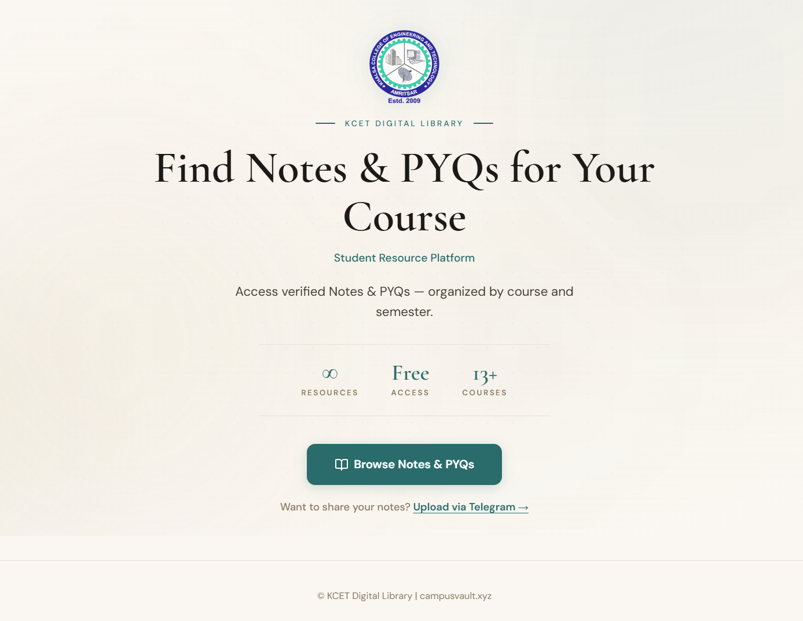

# 🚀 LibraryHub Ecosystem | college-resource-hub

---


A full-stack system for collecting, verifying, and distributing academic notes and PYQs using automation + moderation.

---

## 🌐 Live Demo

* 📚 Website → [Click Here](https://campusvault.xyz/)
* 🤖 Telegram Bot → [Click Here](https://telegram.me/LibraryhandlerBot)

---

## 🧠 Concept

This is not just a website.

It is a **content pipeline system**:

> Submission → Moderation → Storage → Distribution

---

## 🧩 Architecture

```id="arch1"
User → Telegram Bot → Moderation → Database → Website → Users
```

---

## ⚙️ Flow

### 1. Submission

* Users upload notes via Telegram bot
* No signup required

### 2. Moderation

* Admin verifies quality & relevance

### 3. Storage

* Approved content stored in central DB

### 4. Distribution

* Website fetches and displays content

---

## 🎯 Key Strengths

* ❌ No authentication friction
* ✅ Verified content system
* ⚡ Real-time updates
* 🔄 Scalable architecture

---

## 📦 Repositories

* 🤖 Bot
  [Click Here](https://github.com/ChikuX/notes-sharing-bot)

* 🌐 Website
  [Click Here](https://github.com/ChikuX/LibraryHub)

---

## 🛠️ Tech Stack

* Python (Bot)
* Web Stack (Frontend + Backend)
* Shared Database

---

## 🚀 What Makes This Strong?

* Real-world problem solving
* System design thinking
* Automation + moderation pipeline
* Live deployed product

---

## 📈 Future Scope

* Advanced search system
* AI-based tagging
* Contributor leaderboard
* Multi-college scaling

---

## 🤝 Contribution

Open to improvements and scaling ideas.
